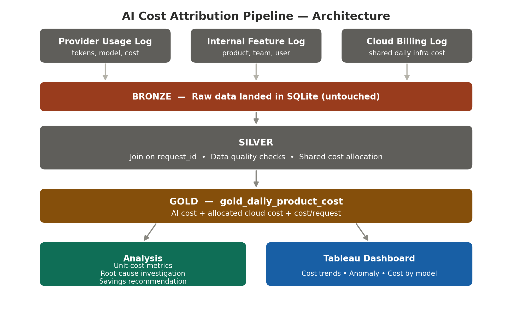
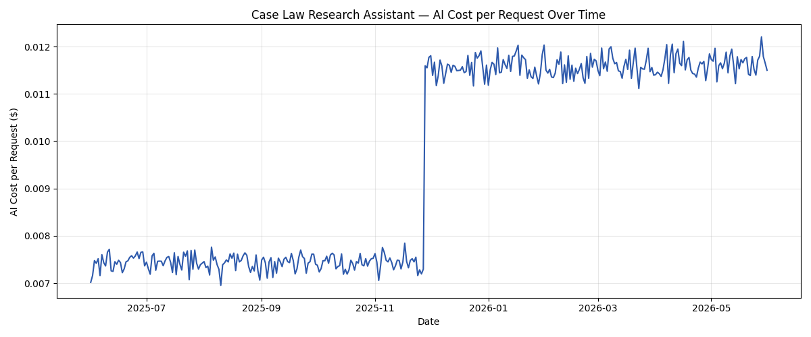

<div align="center">

# 📊 AI Cost Management & Attribution Pipeline

**An end-to-end FinOps project simulating AI cost attribution for a multi-product legal-AI platform**

[](https://python.org)
[](https://pandas.pydata.org)
[](https://sqlite.org)
[](https://public.tableau.com)
[](#-a-note-on-the-data)

**[🔗 View the Live Dashboard on Tableau Public](https://public.tableau.com/views/AICostManagementFinOpsDashboard/Dashboard1?:language=en-US&:display_count=n&:origin=viz_share_link)**

</div>

---

## 🧭 What this is

This project simulates the core workflow of an **AI FinOps / Cost Management analyst**: ingesting multi-source usage and billing data, building a defensible cost-attribution pipeline, defining unit-cost metrics, investigating a real cost anomaly, and delivering a dashboard for both engineering and finance audiences.

> ### ⚠️ A note on the data
> **All data in this project is 100% synthetic**, generated to simulate realistic usage patterns for a multi-product legal-AI platform. No real company data was used or referenced at any point.

---

## 🏢 The simulated scenario

Three fictional AI-powered products, modeled on realistic legal-AI use cases:

| Product | Team | Profile |
|:--|:--|:--|
| 📄 **Contract Summarizer** | Contracts Platform | Long documents → high tokens per request |
| ⚖️ **Case Law Research Assistant** | Research Products | High volume, shorter requests |
| ✍️ **Document Drafting Agent** | Drafting & Review | **Agentic** — multiple chained AI calls per action |

Three disconnected raw data sources are simulated, mirroring what a real company would actually have on hand:

| Source | What it represents |
|:--|:--|
| 🧾 `provider_usage_log` | What the AI provider bills — tokens, model, cost |
| 🗂️ `internal_feature_log` | What the company's own systems log — product, team, user |
| ☁️ `cloud_billing_log` | Shared daily infra cost (compute/storage/transfer/database) — **not tied to any single request** |

---

## 🏗️ Architecture: Bronze → Silver → Gold

<div align="center">

</div>

```
Bronze                Silver                          Gold
──────                ──────                          ────
Raw CSVs      ──▶     Join on request_id       ──▶    gold_daily_product_cost
(untouched)           Data quality checks             one row per product/day:
                       Shared cost allocation          AI cost + allocated cloud
                       Daily/product aggregation       cost + total + cost/request
```

| Layer | Script | What happens |
|:--|:--|:--|
| 🥉 Bronze | `pipeline/load_bronze.py` | Raw data loaded into SQLite, completely untouched |
| 🥈 Silver | `pipeline/build_silver.py` | Join, clean, quality-check, allocate shared costs |
| 🥇 Gold | `pipeline/build_silver.py` | Aggregate into the final trusted cost table |

### 💡 On shared cost allocation

Cloud infrastructure costs can't be joined the way request-level costs can — they arrive as a **lump sum per service per day**, with no `request_id` to match on. This project allocates that cost **proportionally**, based on each product's share of that day's total request volume, with the methodology documented directly in code (`build_silver.py`, Steps 4–5). This mirrors a real, known FinOps challenge: shared costs need a *documented, defensible* allocation method — not an exact join.

---

## 📈 Unit-cost analysis

> A blended `cost_per_request` metric (AI cost + allocated cloud cost) can **hide** real problems if one cost driver dominates another.

In this dataset, allocated cloud cost dominates AI cost for most products — so a planted anomaly was **completely invisible** in the blended metric. It only became visible once AI cost was isolated as its own unit-cost metric. **This was a genuine finding from building this project**, not a scripted example.

<div align="center">

</div>

---

## 🔍 Root-cause investigation

<table>
<tr><td><b>🚨 Observed</b></td><td>AI cost per request for Case Law Research Assistant roughly <b>doubled</b> starting late Nov 2025</td></tr>
<tr><td><b>🧪 Tested</b></td><td>Usage growth (+21% requests — too small to explain it) vs. context length (+110% avg tokens — closely matches the cost increase)</td></tr>
<tr><td><b>✅ Conclusion</b></td><td>Driven by <b>rising context length</b>, not usage growth — consistent with a retrieval/context-filtering regression</td></tr>
<tr><td><b>💰 Recommendation</b></td><td>Restoring context length would cut AI cost per request by an estimated <b>52.3%</b> — ≈ <b>$2,263/year</b> saved for this product alone</td></tr>
</table>

*Full write-up: [`analysis/investigation_findings.md`](analysis/investigation_findings.md)*

Presented as a **recommendation for the owning team to evaluate** — not a mandate, consistent with an enablement-first FinOps model.

---

## 📊 Dashboard

Built in Tableau Public on top of `gold_daily_product_cost`:
- 📈 Total cost trends across all three products
- 🔍 The isolated AI-cost-per-request anomaly
- 🧩 Cost breakdown by model — revealing that **model selection**, not just volume, is a major cost driver

<div align="center">

**[🔗 Open the Live Dashboard](https://public.tableau.com/views/AICostManagementFinOpsDashboard/Dashboard1?:language=en-US&:display_count=n&:origin=viz_share_link)**

</div>

---

## 🛠️ Tools used

**Python** — pandas & numpy for data generation and transformation, `sqlite3` for the local data warehouse, matplotlib for exploratory charting
**SQLite** — lightweight local warehouse for the Bronze/Silver/Gold layers
**Tableau Public** — final dashboard, calculated fields, filters

**Key techniques:** multi-source joins (`pd.merge`), grouped aggregation (`groupby().agg()`), shared-cost allocation logic, SQLite read/write (`to_sql` / `read_sql`), synthetic data generation with weighted randomization and reproducible seeding (`random.seed`, `np.random.seed`)

**Claude** was used throughout to accelerate pipeline design, debugging, and documentation — all logic was independently reviewed, tested, and validated before use.

---

## 📁 Project structure

```
├── pipeline/
│   ├── generate_data.py        # synthetic data generator
│   ├── load_bronze.py          # Bronze layer: raw data ingestion
│   └── build_silver.py         # Silver + Gold: join, allocation, aggregation
├── analysis/
│   ├── unit_costs.py           # unit-cost metric chart
│   ├── investigation.py        # root-cause investigation + savings calc
│   ├── investigation_findings.md
│   ├── export_for_tableau.py   # exports Gold table for Tableau
│   └── ai_cost_per_request_chart.png
└── data/                        # generated locally, not committed (.gitignore)
```

### ▶️ Run it yourself

```bash
python3 pipeline/generate_data.py
python3 pipeline/load_bronze.py
python3 pipeline/build_silver.py
python3 analysis/unit_costs.py
python3 analysis/investigation.py
```

<div align="center">

---
*Built as a hands-on exploration of AI cost management, unit economics, and FinOps attribution.*

</div>